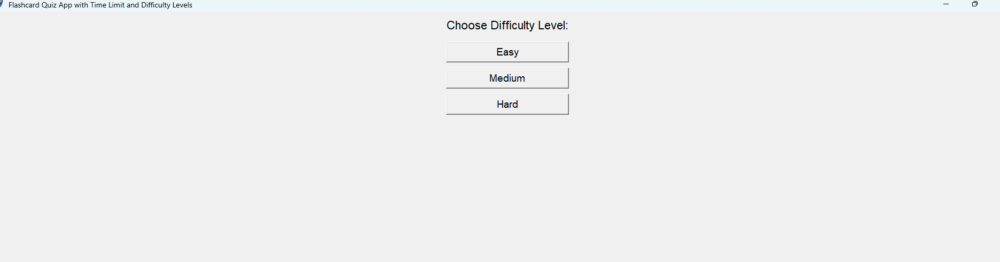
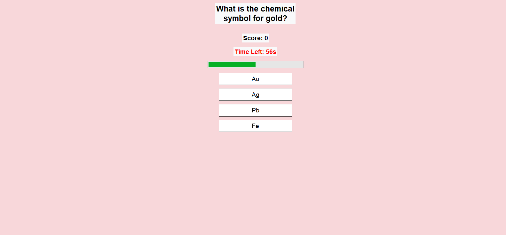
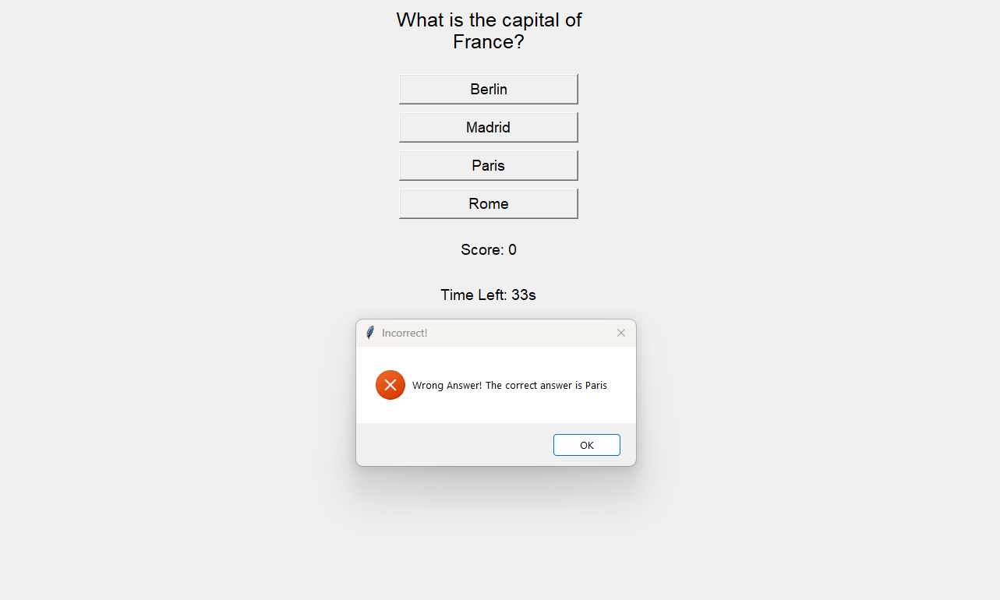

# [FlashCard Quiz App] 🎯

## Basic Details
### Team Name: [Arsha Shaji]

### Team Members
- Member 1: [Arsha Shaji] - [College of engineering and management Punnapra,Alappuzha]
### Hosted Project Link
[mention your project hosted project link here]

### Project Description
[It is a flashcard based quiz app that helps the users to test their knowledge on various topics. The app should feature a time limit, difficulty levels (easy, medium, hard), scoring, and immediate feedback on answers. The goal is to provide a fun, educational experience with an engaging interface.]

### The Problem statement
[Learning through flashcards is a proven method, but traditional methods lack engagement and structure. This app solves that by introducing:
Timed quizzes to improve response speed
Difficulty levels to challenge users at different levels
Score tracking to measure progress]

### The Solution
[The solution to this problem is a Python-based desktop application using the Tkinter library to build the graphical user interface (GUI), along with some basic logic for handling questions, scoring, timers, and feedback. The app allows users to choose a difficulty level, answers questions within a time limit, and provides feedback on whether the answers are correct or incorrect.A user-friendly quiz interface
A timer mechanism (60 seconds per round)
Multiple-choice questions categorized by difficulty
Feedback on correct/wrong answers]

## Technical Details
### Technologies/Components Used
For Software:
- [Python]
- [Tkinter,Flask]
- [threading,tkinter.messagebox,time]
- [Python,IDE-VSCode,packing Tool-Pyinstaller and cx_Freeze,Version control]

For Hardware:
- [Laptop]
- [Python,IDE,Tkinter,threading,pyinstaller,internent access]
- [GitHub]

### Implementation
For Software:. Frontend (React)

We’ll keep things basic—just create flashcards and display quizzes.
1.1 Install React
npx create-react-app flashcard-quiz-app
cd flashcard-quiz-app

1.2 Basic App Structure
    CreateFlashcard: For creating flashcards.
    Quiz: For taking the quiz.

App.js (Main file):
import React, { useState } from 'react';
import CreateFlashcard from './CreateFlashcard';
import Quiz from './Quiz';

3. Running the App
3.1 Run Frontend

In your flashcard-quiz-app folder:

npm start

3.2 Run Backend (Optional)

If you’re using the backend:

node server.js
    Authentication: Add user login for saving personalized flashcards and quiz history.
    Timer: Add a timer to make the quiz more challenging.
# Installation
[python --version  # or `python3 --version` on macOS/Linux
python -m tkinter
pip install flask
pip install django
flask --version  # For Flask
django-admin --version  # For Django
pip install pyinstaller
pip install pygame  # For advanced sound features
]

# Run
[cd path/to/your/project
python flashcard.py  # On Windows/macOS/Linux
python3 flashcard.py  # On macOS/Linux (if Python 2 is the default)
cd path/to/your/flask_project
python app.py  # Replace app.py with your Flask app file name
export FLASK_APP=app.py  # For macOS/Linux
flask run                # Run the app on the default localhost
set FLASK_APP=app.py  # For Windows Command Prompt
flask run
cd path/to/your/django_project
python flashcard.py
python app.py
pyinstaller --onefile --windowed flashcard.py
]

### Project Documentation
For Software:Project Documentation: Flash Card Quiz App
1. Project Overview

The Flash Card Quiz App is a learning tool that allows users to create flashcards, take quizzes, and track their progress. It aims to help users study and reinforce knowledge through interactive quizzes.
2. Features

    Create Flashcards: Users can make their own flashcards with a question and an answer.
    Quiz Mode: Users take quizzes based on the flashcards they created.
    Track Progress: The app tracks the number of correct and incorrect answers.
    Review Mode: Users can review the questions they answered incorrectly.

3. Technologies
    Backend (optional): Node.js with Express.js (if storing flashcards or quiz data online).
    Database (optional): MongoDB (if needed for storing data).

4. Basic User Flow

    Create an Account (optional)
    Create Flashcards
    Take a Quiz
    View Results
    Review Mistakes

5. Development Process

    Agile Development: The project will follow an iterative approach with regular updates and testing.
    Version Control: Git and GitHub will be used for tracking code changes.

6. Testing

    Unit Testing: Ensure quiz logic and flashcard creation work correctly.
    UI Testing: Make sure the app is easy to use on both desktop and mobile.

7. Deployment

    Web Version: Host on Netlify or Vercel.
    Mobile Version: Publish to Google Play Store and Apple App Store (if developed as a mobile app).

8. Future Features

    Multiplayer quiz mode
    Voice-based answers

# Screenshots (Add at least 3)

*Add caption explaining what this shows*

*Add caption explaining what this shows*

*Add caption explaining what this shows*

# Diagrams------+

# Schematic & Circuit
     

# Build Photos

*List out all components shown*

*Explain the build steps*

*Explain the final build*

### Project Demo
# Video
[https://drive.google.com/file/d/1AUF8MIWCx7kc4gjL7qBDMW8nltNp9pHz/view?usp=drive_link]
*Explain what the video demonstrates*

# Additional Demos
[Add any extra demo materials/links]

## Team Contributions
Arsha Shaji:
Developed the Tkinter-based GUI
Implemented quiz logic and timer
Integrated difficulty levels
Built the scoring system

---
Made with ❤️ at TinkerHub
